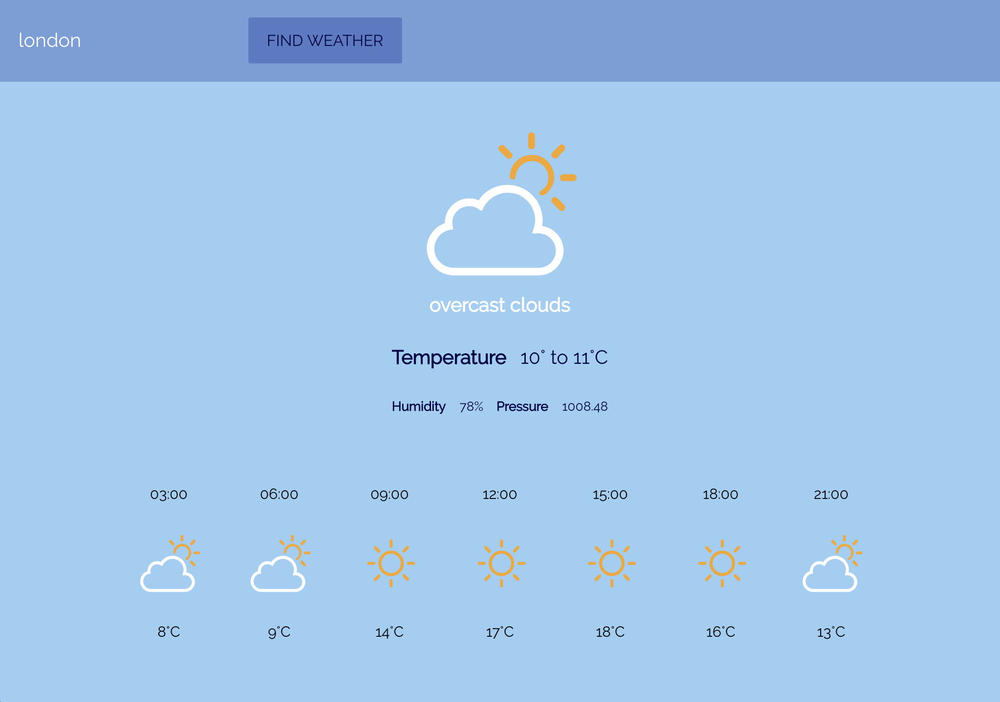

This project was bootstrapped with [Create React App](https://github.com/facebook/create-react-app).

### Aim
connecting to a real-time weather API to make a weather app that looks like this:

## Demo video

### Display the weather forecast for the next 24 hours

Added a section displays the weather over the next 24 hours in the given location **for each 3-hour chunk**.

